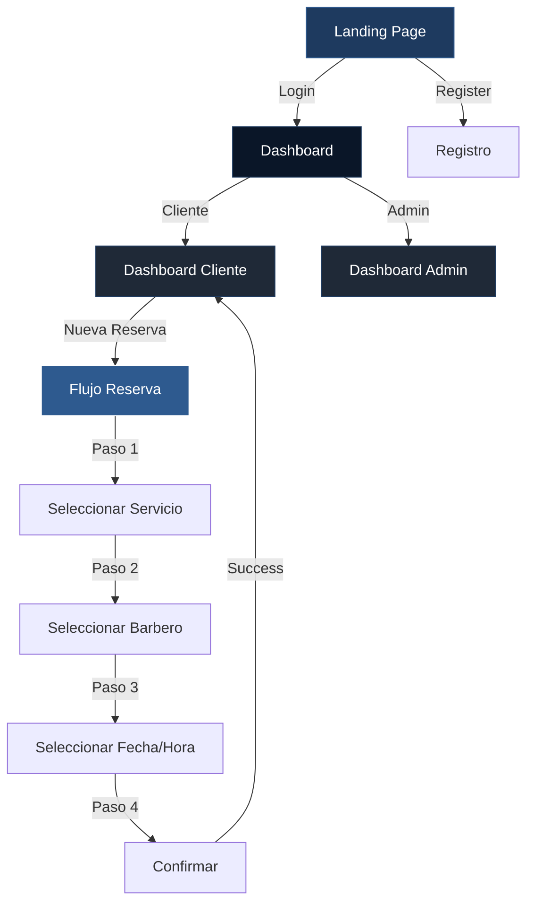

# Sistema de Diseño - Barbería UAN
## Modernización con Azul Oscuro, Blanco y Negro

---

## 🎨 Paleta de Colores

### Colores Principales
```css
--primary-blue: #1E3A5F;        /* Azul Oscuro Principal */
--primary-blue-dark: #0A1628;   /* Azul Profundo */
--primary-blue-light: #2E5A8F;  /* Azul Claro para hover */

--accent-white: #FFFFFF;        /* Blanco Puro */
--accent-off-white: #F5F7FA;    /* Blanco Suave */
--accent-light-gray: #E5E7EB;   /* Gris Claro */

--neutral-black: #000000;       /* Negro Puro */
--neutral-dark: #121212;        /* Negro Suave */
--neutral-gray: #1F2937;        /* Gris Oscuro */
--neutral-medium: #374151;      /* Gris Medio */
```

### Colores de Estado
```css
--success: #10B981;             /* Verde para éxito */
--error: #EF4444;               /* Rojo para errores */
--warning: #F59E0B;             /* Amarillo para advertencias */
--info: #3B82F6;                /* Azul para información */
```

### Colores de Texto
```css
--text-primary: #FFFFFF;        /* Texto principal en fondos oscuros */
--text-secondary: #9CA3AF;      /* Texto secundario */
--text-dark: #1F2937;           /* Texto en fondos claros */
--text-muted: #6B7280;          /* Texto deshabilitado */
```

---

## 🌈 Gradientes

### Gradiente Principal (Fondos)
```css
background: linear-gradient(135deg, #0A1628 0%, #1E3A5F 50%, #121212 100%);
```

### Gradiente de Cards
```css
background: linear-gradient(145deg, #1F2937 0%, #0A1628 100%);
```

### Gradiente de Botones
```css
background: linear-gradient(135deg, #1E3A5F 0%, #2E5A8F 100%);
```

### Gradiente Glassmorphism
```css
background: rgba(30, 58, 95, 0.1);
backdrop-filter: blur(10px);
border: 1px solid rgba(255, 255, 255, 0.1);
```

---

## 🎭 Efectos y Sombras

### Sombras
```css
--shadow-sm: 0 2px 4px rgba(10, 22, 40, 0.3);
--shadow-md: 0 4px 12px rgba(10, 22, 40, 0.4);
--shadow-lg: 0 10px 25px rgba(10, 22, 40, 0.5);
--shadow-xl: 0 20px 40px rgba(10, 22, 40, 0.6);

/* Sombra con tono azul */
--shadow-blue: 0 8px 20px rgba(30, 58, 95, 0.4);
--shadow-blue-glow: 0 0 20px rgba(30, 58, 95, 0.6);
```

### Efectos de Hover
```css
/* Elevación suave */
transform: translateY(-4px);
box-shadow: var(--shadow-blue);

/* Brillo sutil */
filter: brightness(1.1);

/* Escala */
transform: scale(1.02);
```

---

## 📐 Componentes Específicos

### 1. Header / Navbar
```css
.landing-header {
  background: rgba(10, 22, 40, 0.95);
  backdrop-filter: blur(20px);
  border-bottom: 1px solid rgba(30, 58, 95, 0.3);
  box-shadow: 0 4px 12px rgba(0, 0, 0, 0.5);
}

.logo h1 {
  background: linear-gradient(135deg, #2E5A8F, #FFFFFF);
  -webkit-background-clip: text;
  -webkit-text-fill-color: transparent;
  font-weight: 800;
}
```

### 2. Botones

#### Botón Primario (Azul)
```css
.btn-primary {
  background: linear-gradient(135deg, #1E3A5F 0%, #2E5A8F 100%);
  color: #FFFFFF;
  border: 2px solid transparent;
  padding: 12px 32px;
  border-radius: 12px;
  font-weight: 600;
  box-shadow: 0 4px 12px rgba(30, 58, 95, 0.4);
  transition: all 0.3s cubic-bezier(0.4, 0, 0.2, 1);
}

.btn-primary:hover {
  transform: translateY(-2px);
  box-shadow: 0 8px 20px rgba(30, 58, 95, 0.6);
  background: linear-gradient(135deg, #2E5A8F 0%, #3E6AAF 100%);
}
```

#### Botón Secundario (Negro/Blanco)
```css
.btn-secondary {
  background: #1F2937;
  color: #FFFFFF;
  border: 2px solid rgba(255, 255, 255, 0.1);
  padding: 12px 32px;
  border-radius: 12px;
  transition: all 0.3s ease;
}

.btn-secondary:hover {
  background: #374151;
  border-color: rgba(255, 255, 255, 0.2);
}
```

#### Botón Outline
```css
.btn-outline {
  background: transparent;
  color: #1E3A5F;
  border: 2px solid #1E3A5F;
  padding: 12px 32px;
  border-radius: 12px;
}

.btn-outline:hover {
  background: #1E3A5F;
  color: #FFFFFF;
}
```

### 3. Cards

#### Service Card (Glassmorphism)
```css
.service-card {
  background: rgba(31, 41, 55, 0.6);
  backdrop-filter: blur(10px);
  border: 1px solid rgba(30, 58, 95, 0.3);
  border-radius: 16px;
  padding: 24px;
  transition: all 0.4s cubic-bezier(0.4, 0, 0.2, 1);
  position: relative;
  overflow: hidden;
}

.service-card::before {
  content: '';
  position: absolute;
  top: 0;
  left: 0;
  right: 0;
  height: 4px;
  background: linear-gradient(90deg, #1E3A5F, #2E5A8F);
  transform: scaleX(0);
  transition: transform 0.3s ease;
}

.service-card:hover::before {
  transform: scaleX(1);
}

.service-card:hover {
  transform: translateY(-8px);
  border-color: rgba(30, 58, 95, 0.6);
  box-shadow: 0 12px 30px rgba(30, 58, 95, 0.4);
}
```

#### Barbero Card
```css
.barbero-card {
  background: linear-gradient(145deg, #1F2937, #0A1628);
  border: 2px solid rgba(30, 58, 95, 0.2);
  border-radius: 20px;
  padding: 28px;
  text-align: center;
  transition: all 0.3s ease;
}

.barbero-card:hover {
  border-color: #1E3A5F;
  box-shadow: 0 0 30px rgba(30, 58, 95, 0.5);
}

.barber-avatar {
  width: 100px;
  height: 100px;
  border-radius: 50%;
  border: 4px solid #1E3A5F;
  box-shadow: 0 4px 12px rgba(30, 58, 95, 0.5);
  margin: 0 auto 16px;
}
```

### 4. Modales
```css
.modal-overlay {
  background: rgba(0, 0, 0, 0.85);
  backdrop-filter: blur(8px);
}

.modal-content {
  background: linear-gradient(145deg, #1F2937, #121212);
  border: 2px solid rgba(30, 58, 95, 0.3);
  border-radius: 24px;
  padding: 40px;
  box-shadow: 0 20px 60px rgba(0, 0, 0, 0.8);
}

.modal-content h2 {
  background: linear-gradient(135deg, #2E5A8F, #FFFFFF);
  -webkit-background-clip: text;
  -webkit-text-fill-color: transparent;
  font-size: 2rem;
  font-weight: 700;
}
```

### 5. Inputs
```css
input[type="text"],
input[type="email"],
input[type="password"],
input[type="tel"],
input[type="date"] {
  background: rgba(31, 41, 55, 0.5);
  border: 2px solid rgba(30, 58, 95, 0.3);
  border-radius: 12px;
  padding: 14px 18px;
  color: #FFFFFF;
  font-size: 1rem;
  transition: all 0.3s ease;
}

input:focus {
  outline: none;
  border-color: #1E3A5F;
  background: rgba(31, 41, 55, 0.8);
  box-shadow: 0 0 0 4px rgba(30, 58, 95, 0.2);
}

input::placeholder {
  color: #6B7280;
}
```

### 6. Hero Section
```css
.hero {
  background: linear-gradient(135deg, #0A1628 0%, #1E3A5F 50%, #000000 100%);
  position: relative;
  overflow: hidden;
}

.hero::before {
  content: '';
  position: absolute;
  top: 0;
  left: 0;
  right: 0;
  bottom: 0;
  background: 
    radial-gradient(circle at 20% 50%, rgba(30, 58, 95, 0.3) 0%, transparent 50%),
    radial-gradient(circle at 80% 80%, rgba(46, 90, 143, 0.2) 0%, transparent 50%);
  pointer-events: none;
}

.hero-content h2 {
  font-size: 4rem;
  font-weight: 800;
  background: linear-gradient(135deg, #FFFFFF 0%, #2E5A8F 100%);
  -webkit-background-clip: text;
  -webkit-text-fill-color: transparent;
  line-height: 1.2;
}
```

### 7. Stats Cards (Dashboard)
```css
.stat-card {
  background: linear-gradient(135deg, #1E3A5F 0%, #0A1628 100%);
  border: 1px solid rgba(255, 255, 255, 0.1);
  border-radius: 16px;
  padding: 28px;
  position: relative;
  overflow: hidden;
}

.stat-card::before {
  content: '';
  position: absolute;
  top: 0;
  right: 0;
  width: 100px;
  height: 100px;
  background: radial-gradient(circle, rgba(255, 255, 255, 0.1) 0%, transparent 70%);
  border-radius: 50%;
  transform: translate(30%, -30%);
}

.stat-value {
  font-size: 2.5rem;
  font-weight: 800;
  color: #FFFFFF;
  margin-bottom: 8px;
}

.stat-label {
  font-size: 0.95rem;
  color: #9CA3AF;
  text-transform: uppercase;
  letter-spacing: 0.5px;
}
```

### 8. Tabs (Admin Dashboard)
```css
.admin-tabs {
  display: flex;
  gap: 12px;
  background: rgba(31, 41, 55, 0.5);
  padding: 8px;
  border-radius: 16px;
  margin-bottom: 32px;
}

.admin-tabs button {
  flex: 1;
  padding: 12px 24px;
  background: transparent;
  border: none;
  color: #9CA3AF;
  border-radius: 12px;
  font-weight: 600;
  transition: all 0.3s ease;
  cursor: pointer;
}

.admin-tabs button.active {
  background: linear-gradient(135deg, #1E3A5F, #2E5A8F);
  color: #FFFFFF;
  box-shadow: 0 4px 12px rgba(30, 58, 95, 0.4);
}

.admin-tabs button:hover:not(.active) {
  background: rgba(30, 58, 95, 0.2);
  color: #FFFFFF;
}
```

### 9. Reserva Flow - Steps
```css
.step {
  background: rgba(31, 41, 55, 0.4);
  border: 2px solid rgba(30, 58, 95, 0.3);
  border-radius: 20px;
  padding: 32px;
  margin-bottom: 24px;
}

.step h3 {
  color: #FFFFFF;
  font-size: 1.5rem;
  margin-bottom: 24px;
  display: flex;
  align-items: center;
  gap: 12px;
}

.step h3::before {
  content: '';
  width: 40px;
  height: 4px;
  background: linear-gradient(90deg, #1E3A5F, #2E5A8F);
  border-radius: 2px;
}
```

### 10. Horarios (Time Slots)
```css
.horario-slot {
  background: rgba(31, 41, 55, 0.6);
  border: 2px solid rgba(30, 58, 95, 0.3);
  border-radius: 12px;
  padding: 16px 24px;
  color: #FFFFFF;
  font-weight: 600;
  transition: all 0.3s ease;
  cursor: pointer;
}

.horario-slot:hover {
  background: rgba(30, 58, 95, 0.4);
  border-color: #1E3A5F;
  transform: scale(1.05);
}

.horario-slot.selected {
  background: linear-gradient(135deg, #1E3A5F, #2E5A8F);
  border-color: #2E5A8F;
  box-shadow: 0 4px 12px rgba(30, 58, 95, 0.5);
}
```

---

## 🎬 Animaciones

### Fade In
```css
@keyframes fadeIn {
  from {
    opacity: 0;
    transform: translateY(20px);
  }
  to {
    opacity: 1;
    transform: translateY(0);
  }
}

.fade-in {
  animation: fadeIn 0.6s ease-out;
}
```

### Slide In
```css
@keyframes slideIn {
  from {
    opacity: 0;
    transform: translateX(-30px);
  }
  to {
    opacity: 1;
    transform: translateX(0);
  }
}
```

### Pulse (para botones CTA)
```css
@keyframes pulse {
  0%, 100% {
    box-shadow: 0 0 0 0 rgba(30, 58, 95, 0.7);
  }
  50% {
    box-shadow: 0 0 0 10px rgba(30, 58, 95, 0);
  }
}

.btn-cta {
  animation: pulse 2s infinite;
}
```

---

## 📱 Responsive Breakpoints

```css
/* Mobile First */
@media (min-width: 640px) { /* sm */ }
@media (min-width: 768px) { /* md */ }
@media (min-width: 1024px) { /* lg */ }
@media (min-width: 1280px) { /* xl */ }
```

---

## ✨ Mejores Prácticas

1. **Contraste**: Asegurar ratio mínimo 4.5:1 para texto
2. **Transiciones**: Usar `cubic-bezier(0.4, 0, 0.2, 1)` para suavidad
3. **Hover States**: Siempre incluir feedback visual
4. **Focus States**: Importante para accesibilidad
5. **Loading States**: Usar skeleton screens con shimmer azul
6. **Micro-interacciones**: Pequeñas animaciones en clicks

---

## 🎯 Diagrama de Flujo Visual



---

## 📊 Jerarquía Visual

```
┌─────────────────────────────────────────┐
│  Header (Negro/Azul Oscuro)             │
│  Logo (Gradiente Azul-Blanco)           │
└─────────────────────────────────────────┘
┌─────────────────────────────────────────┐
│  Hero (Gradiente Azul Oscuro-Negro)     │
│  ┌───────────────────────────────────┐  │
│  │ Título (Blanco con gradiente)    │  │
│  │ Subtítulo (Gris claro)           │  │
│  │ CTA Button (Azul brillante)      │  │
│  └───────────────────────────────────┘  │
└─────────────────────────────────────────┘
┌─────────────────────────────────────────┐
│  Servicios Grid                          │
│  ┌──────┐ ┌──────┐ ┌──────┐            │
│  │ Card │ │ Card │ │ Card │            │
│  │ Azul │ │ Azul │ │ Azul │            │
│  └──────┘ └──────┘ └──────┘            │
└─────────────────────────────────────────┘
```

---

## 🔧 Utilidades CSS

```css
/* Espaciado */
.mt-1 { margin-top: 0.25rem; }
.mt-2 { margin-top: 0.5rem; }
.mt-4 { margin-top: 1rem; }
.mt-8 { margin-top: 2rem; }

/* Texto */
.text-primary { color: var(--text-primary); }
.text-secondary { color: var(--text-secondary); }
.text-blue { color: var(--primary-blue); }

/* Fondos */
.bg-dark { background: var(--neutral-dark); }
.bg-blue { background: var(--primary-blue); }
.bg-gradient-blue {
  background: linear-gradient(135deg, #1E3A5F, #2E5A8F);
}

/* Bordes */
.border-blue { border: 2px solid var(--primary-blue); }
.border-white { border: 2px solid rgba(255, 255, 255, 0.1); }

/* Sombras */
.shadow-sm { box-shadow: var(--shadow-sm); }
.shadow-md { box-shadow: var(--shadow-md); }
.shadow-blue { box-shadow: var(--shadow-blue); }
```

---

Este sistema de diseño garantiza consistencia visual, modernidad y una experiencia de usuario excepcional con la paleta Azul Oscuro, Blanco y Negro.
